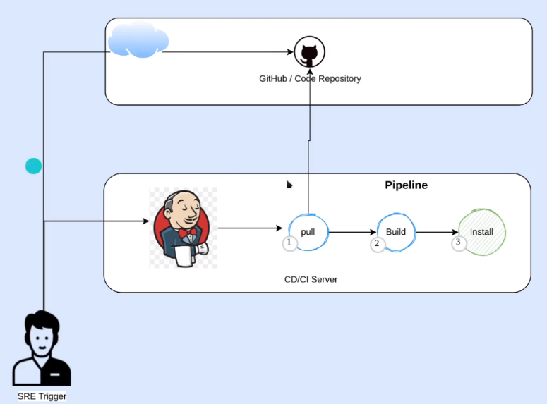
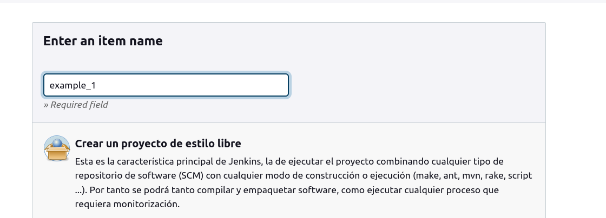
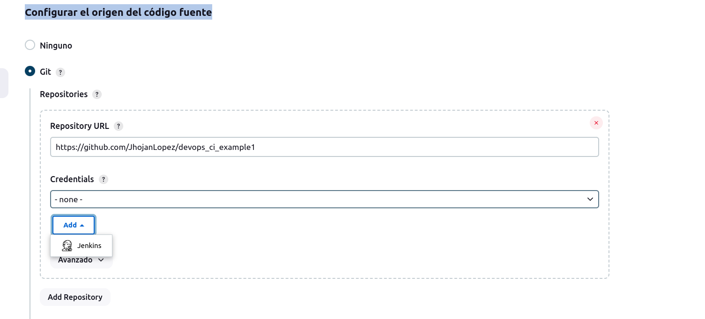
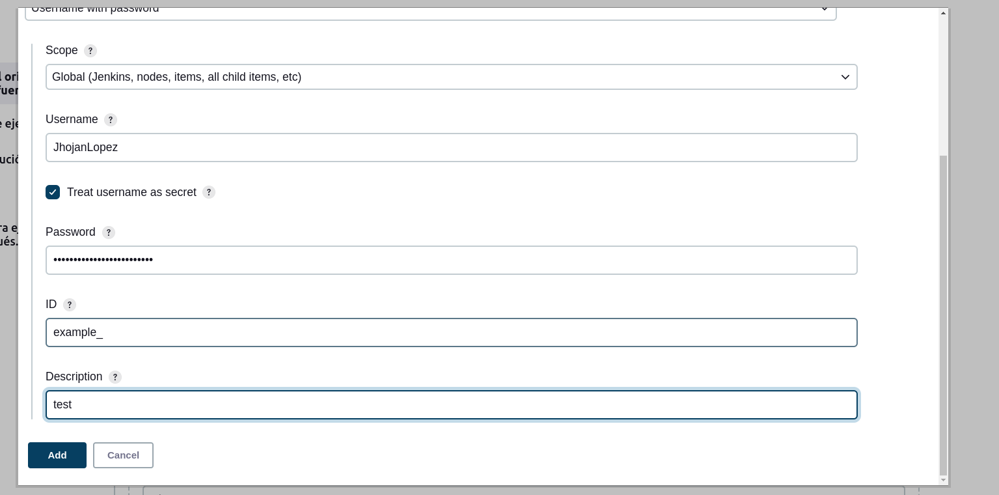
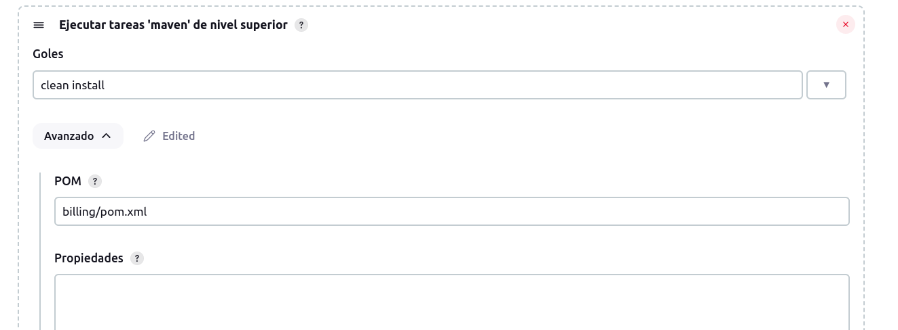
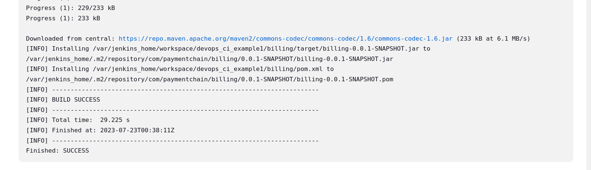

# Descripción

Este proyecto es usado como ejemplo #1 de ci, la estructura del pipeline a ejecutar con este proyecto es:

## Paso a paso
1. Generar pipeline -> ir al panel de jenkins y oprimir la opcion crear job, seguidamente poner nombre oprimir opcion 1:

2. Una vez creado el pipeline ir a la seccion configurar el origen del código fuente, en esta seccion se debe poner la ruta del repositorio y agregar
   credenciales

2.1 Una vez oprimimos agregar credenciales dejamos por defecto y modificamos username el password donde debemos indicar el token creado (github), el check box se marca por recomendacion ya que no mostrara en los logs el username del repositorio

3. Seleccionamos las credenciales creadas y establecemos la rama la cual se hara el build (branches to build) en este caso sera main.

4. ir a la seccion build steps y seleccionar tareas con maven de nivel superior donde indicamos los comandos a ejecutar con maven como el clean(limpiar la carpeta target) y el install(genera el jar y lo agrega en una carpeta) comandos separados por el espacio, tambien debemos indicar la ruta relativa
del pom.xml de acuerdo a la estructura del proyecto en este caso seria billing/pom.xml  finalmente oprimimos guardar donde se creara el pipeline (se puede visualizar y editar en el inicio)

5. ir al incio y ejecutar el pipeline(oprimir opcion de icono en play o construir ahora)

5.1 al finalizar en los logs veremos que la aplicacion se ha generado correctamente y se ha pasado a una ruta especifica (en el contenedor de jenkins). se debe tener en cuenta que esto es una prueba y la apliaccion no deberia ir dentro del contenedor de jenkins.

## Notas

- es importante generar un token para que jenkins se pueda validar con github (en este caso) usar : 
  settings > developer settings > personal access tokens > token(classsic) > generate new token(classic)

- importante mencionar que este ejemplo es de integracion continua y se debe hacer manual la integracion ejecutando el pipeline.